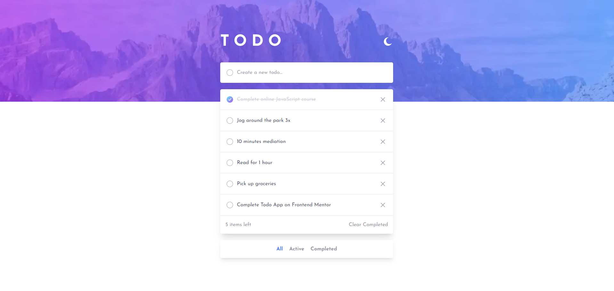

# Todo app solution

Simple to use interacive todo application. This is a solution to the challenge [Todo app challenge on Frontend Mentor](https://www.frontendmentor.io/challenges/todo-app-Su1_KokOW).

## Usage

Live solution at :  [https://www.frontendmentor.io/solutions/todo-list-with-react-B6lJmulCHf](https://www.frontendmentor.io/solutions/todo-list-with-react-B6lJmulCHf)

Users should be able to:

- [x] View the optimal layout for the app depending on their device's screen size
- [x] See hover states for all interactive elements on the page
- [x] Add new todos to the list
- [x] Mark todos as complete
- [x] Delete todos from the list
- [x] Filter by all/active/complete todos
- [x] Clear all completed todos
- [x] Toggle light and dark mode
- [x] **Bonus**: Drag and drop to reorder items on the list

## Overview 

### Screenshot

### Links

- Solution URL: [https://www.frontendmentor.io/solutions/todo-list-with-react-B6lJmulCHf](https://www.frontendmentor.io/solutions/todo-list-with-react-B6lJmulCHf)
- Live Site URL: [https://cloudtodopoc.netlify.app/](https://cloudtodopoc.netlify.app/)

### Built with

- Semantic HTML5 markup
- Flexbox
- Mobile-first workflow
- [Dnd-kit](https://dndkit.com/) - for draggable items
- [FireStore](https://firebase.google.com/) - for the backend
- [React](https://reactjs.org/) - JS library
- [Next.js](https://nextjs.org/) - React framework
- [tailwindCss](https://tailwindcss.com/) - For styles
